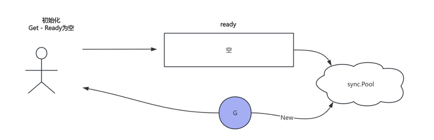
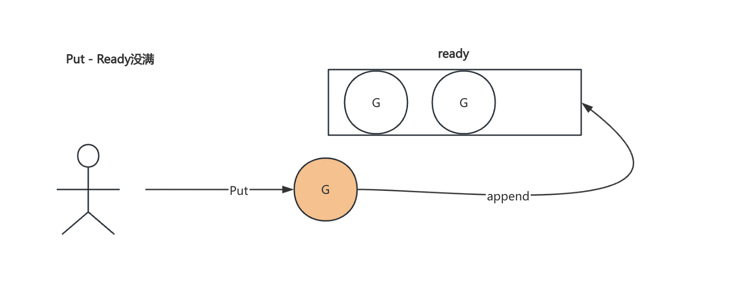
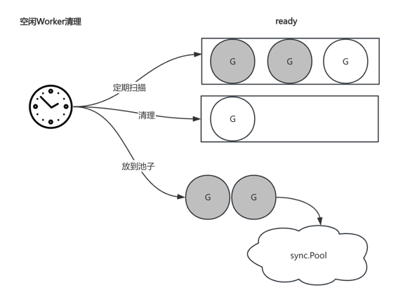

# goroutine pool

tips: inspired by fast-http、ants

## 背景
虽然创建goroutine资源开销很低(内存仅占用2k)，可是如果创建大量的goroutine，会带来两个潜在的问题，第一内存占用越来越高，极端情况下可能会导致服务OOM；第二物理CPU核是有限的，大量的goroutine竞争cpu，导致频繁上下文切换，最终影响goroutine调度耗时。
## 开源实现
### fast-http
net/http库为每个连接分配2个goroutine，分别负责读写请求。随着连接数的增长, goroutine被大量创建，尤其在http短连接场景下，大量goroutine存在频繁的上下文切换，影响服务性能。fasthttp库通过协程池实现`复用`协程, 并且模块设计非常清晰易理解，除此之外作者也做了很多极致的内存优化，非常值得学习。

### ants
高性能的goroutine协程池,支持多种模式，是目前主流的协程池，同时也是非常好的学习资源。


## 实战

即便业界有不少成熟的组件，可是作为工程师要知其所以然，接下来咱就设计一个协程池，重点理解和掌握`资源复用`的思想。

### 功能特性
- 高性能
- 支持弹性扩缩
- 接入门槛低


### 设计细节
#### 获取worker
存储结构:  
- ready数组, 服用内存空间，无需频繁申请
- LIFO, 一定程度上高效利用CPU

实现原理:   
先从ready数组中获取，如果ready为空，此时需要判断当前worker数是否超过阈值，如果没有则从sync.Pool中new一个新的worker;
反之需要重新获取。



### 归还worker
当执行完task func之后，会将worker直接`append`到ready数组中


### 清理空闲worker
定期扫描ready数组，由于ready数组是LIFO模式, 因此可以采用二分查找快速定位空闲超时的worker.

## Example:

```shell
go get github.com/codingWhat/goroutinepool
```

```golang
package main

import (
	"fmt"
	"sync"
	"sync/atomic"
	"time"

	"github.com/codingWhat/goroutinepool"
)

func main() {
	var wg sync.WaitGroup
	var sum atomic.Int32
	num := 1000
	wg.Add(num - 1)
	customFunc := func(a any) error {
		defer wg.Done()
		i := a.(int)
		sum.Add(int32(i))
		return nil
	}
	p := goroutinepool.NewWithFunc(100, customFunc)
	defer p.Release()
	for i := 1; i < num; i++ {
		p.Invoke(i)
	}
	time.Sleep(3 * time.Second)
	fmt.Printf("1 + %d = %d \n", num, sum.Load())
}	
```
